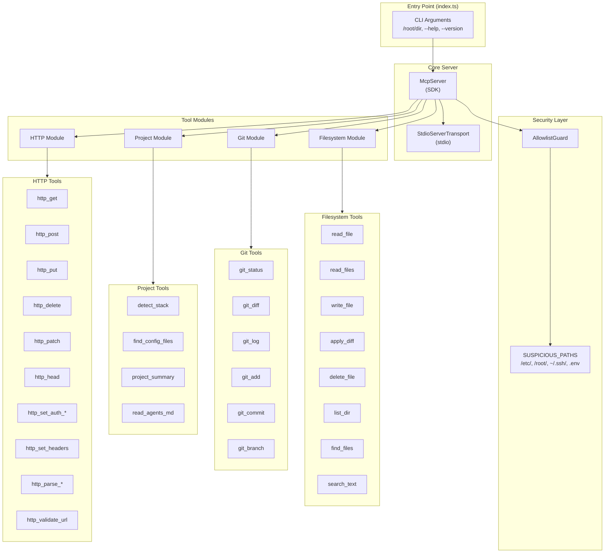
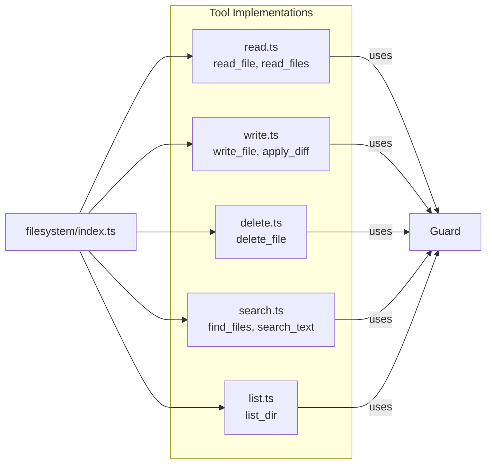
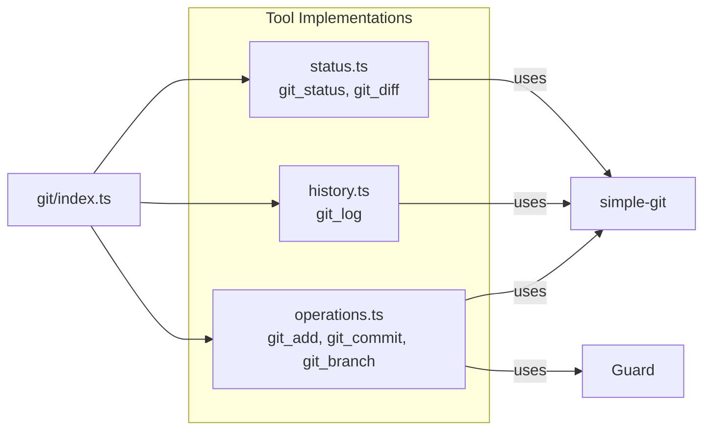
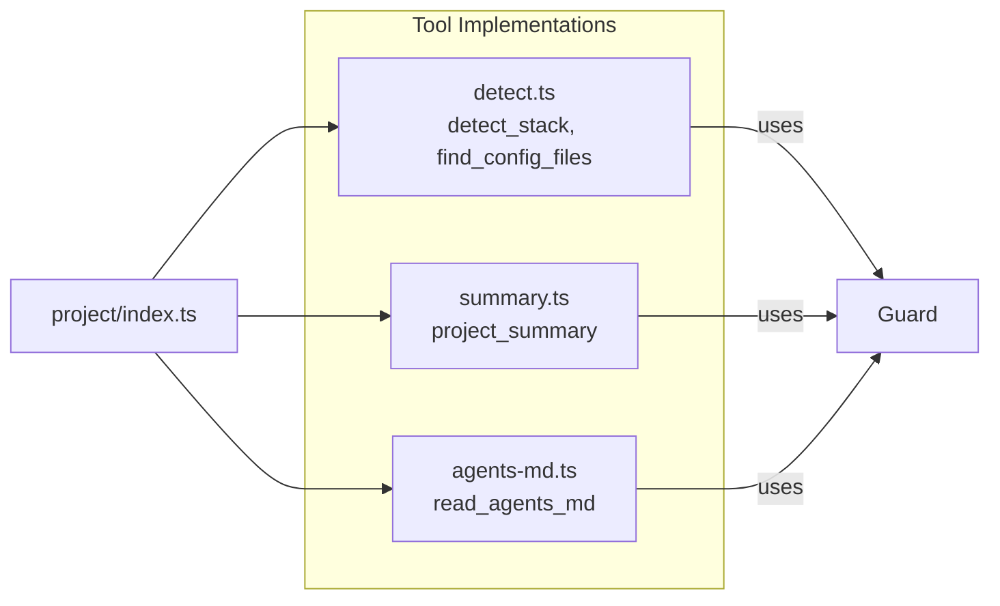
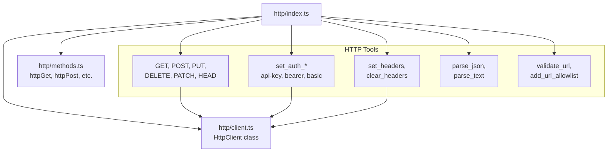
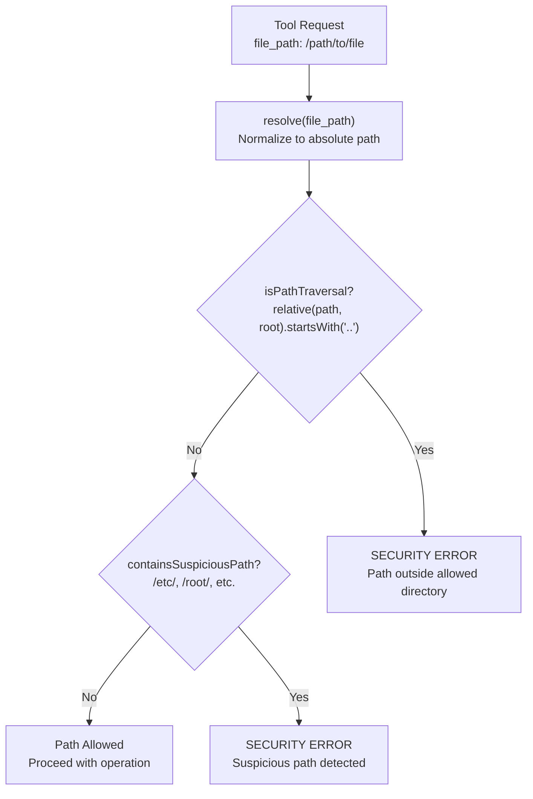
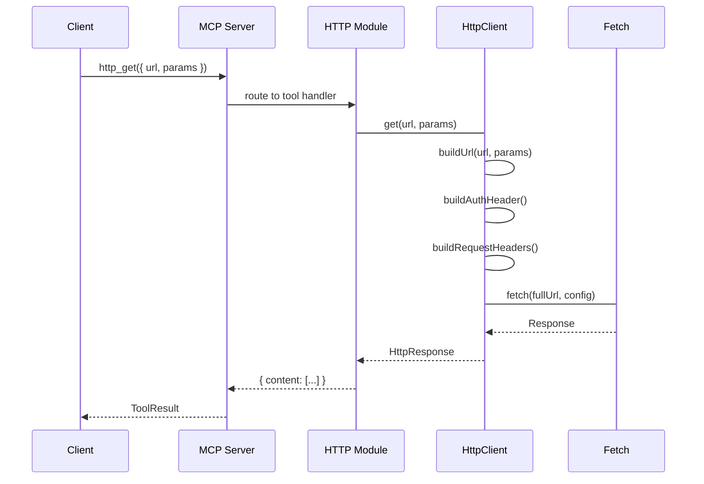
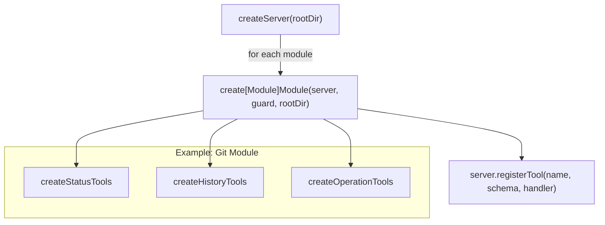

# Architecture Documentation

This document describes the system architecture of mcp-filesystem-pro, a production-grade MCP server for filesystem, git, project analysis, and HTTP operations.

---

## 1. System Architecture Diagram

The MCP server follows a modular architecture with a central server that orchestrates multiple tool modules.



**Description:**
- The entry point parses CLI arguments and creates the server
- The `McpServer` from the SDK handles tool registration and request routing
- `StdioServerTransport` communicates via stdin/stdout (standard MCP protocol)
- `AllowlistGuard` validates all file paths before operations
- Four modules register their tools with the server
- Each module exposes multiple tools (18 tools total)

---

## 2. Tool Module Architecture

Each module follows a factory pattern: `create[Module]Module(server, guard, rootDir)` registers all tools for that domain.

### 2.1 Filesystem Module



**Tools (8):**
- `read_file` - Read single file with optional line range
- `read_files` - Read multiple files in one call
- `write_file` - Write to new file (not overwrite)
- `apply_diff` - Apply unified diff (most important tool)
- `delete_file` - Delete with confirmation required
- `list_dir` - List directory with metadata
- `find_files` - Find by glob pattern
- `search_text` - Regex search with context lines

### 2.2 Git Module



**Tools (6):**
- `git_status` - Repository state (staged, unstaged, untracked)
- `git_diff` - Working tree diff or between commits
- `git_log` - Commit history with configurable format
- `git_add` - Stage files
- `git_commit` - Create commit with message
- `git_branch` - List, create, or switch branches

### 2.3 Project Module



**Tools (4):**
- `detect_stack` - Detect technology stack (package.json, Cargo.toml, etc.)
- `find_config_files` - Find relevant configuration files
- `project_summary` - Generate project overview
- `read_agents_md` - Parse AGENTS.md if present

### 2.4 HTTP Module



**Tools (20+):**
- Request methods: `http_get`, `http_post`, `http_put`, `http_delete`, `http_patch`, `http_head`
- Auth: `http_set_auth_api_key`, `http_set_auth_bearer`, `http_set_auth_basic`, `http_clear_auth`
- Headers: `http_set_headers`, `http_clear_headers`
- Response: `http_parse_json`, `http_parse_text`, `http_get_response_headers`, `http_get_status_code`
- Security: `http_validate_url`, `http_add_url_allowlist`, `http_remove_url_allowlist`, `http_list_allowlist`

---

## 3. Security Flow (AllowlistGuard)

The AllowlistGuard validates all file paths to prevent path traversal attacks.



**Validation Rules:**
1. Resolve path to absolute form
2. Check path traversal: relative path from root must not start with `..`
3. Check suspicious paths: block `/etc/`, `/root/`, `~/.ssh/`, `.env`, `/proc/`, `/sys/`
4. Throw error with clear message on any violation

**Example validation:**
```
Root: /home/user/project
Input: /home/user/project/src/index.ts -> ALLOWED
Input: /home/user/project/../../../etc/passwd -> BLOCKED (starts with ..)
Input: /etc/passwd -> BLOCKED (suspicious)
```

---

## 4. Request Flow (HTTP Module)

HTTP requests flow through multiple layers with authentication, headers, and security validation.



**Flow Details:**
1. Tool handler receives request with URL and optional params
2. `HttpClient.get()` builds full URL with query parameters
3. Auth header is built based on current auth settings (api-key, bearer, basic)
4. Custom headers and content-type are added
5. Fetch is called with timeout and abort controller
6. Response is parsed (JSON or text) based on content-type
7. Last response is stored for later inspection
8. Result is returned with status code and headers

---

## 5. Project Structure Tree

```
mcp-filesystem-pro/
|
|-- src/
|   |-- index.ts                    # Entry point, CLI handling
|   |-- server.ts                   # Server factory function
|   |
|   |-- modules/
|   |   |-- filesystem/
|   |   |   |-- index.ts           # Module factory
|   |   |   |-- read.ts            # read_file, read_files
|   |   |   |-- write.ts           # write_file, apply_diff
|   |   |   |-- delete.ts          # delete_file
|   |   |   |-- search.ts          # find_files, search_text
|   |   |   |-- list.ts            # list_dir
|   |   |
|   |   |-- git/
|   |   |   |-- index.ts           # Module factory
|   |   |   |-- status.ts          # git_status, git_diff
|   |   |   |-- history.ts         # git_log
|   |   |   |-- operations.ts      # git_add, git_commit, git_branch
|   |   |   |-- git-context.ts
|   |   |
|   |   |-- project/
|   |   |   |-- index.ts           # Module factory
|   |   |   |-- detect.ts          # detect_stack, find_config_files
|   |   |   |-- summary.ts         # project_summary
|   |   |   |-- agents-md.ts       # read_agents_md
|   |   |
|   |   |-- http/
|   |       |-- index.ts           # Module factory (20+ tools)
|   |       |-- client.ts          # HttpClient class
|   |       |-- methods.ts        # httpGet, httpPost, etc.
|   |
|   |-- security/
|   |   |-- allowlist.ts           # AllowlistGuard class
|   |   |-- sanitize.ts            # Input sanitization
|   |
|   |-- constants/
|   |   |-- index.ts
|   |   |-- shared.ts              # SUSPICIOUS_PATHS, DOUBLE_DOT
|   |   |-- filesystem.ts
|   |   |-- git.ts
|   |   |-- http.ts
|   |   |-- project.ts
|   |   |-- limits.ts
|   |   |-- operations.ts
|   |
|   |-- types/
|   |   |-- index.ts               # Shared TypeScript types
|   |
|   |-- utils/
|       |-- logger.ts              # Structured logging
|       |-- retry.ts               # Retry with backoff
|       |-- url-validator.ts       # URL security validation
|       |-- file.ts                # File utilities
|
|-- tests/
|   |-- filesystem.test.ts
|   |-- git.test.ts
|   |-- security.test.ts
|   |-- http.test.ts
|
|-- docs/
|   |-- ARCHITECTURE.md            # This file
|   |-- TOOLS.md                  # Tool documentation
|   |-- SECURITY.md                # Security model
|   |-- dev-setup.md              # Development setup
|
|-- package.json
|-- tsconfig.json
|-- bunfig.toml
|-- Dockerfile
|-- docker-compose.yml
```

---

## 6. Module Factory Pattern

Each module uses a consistent factory pattern for registration:



**Benefits:**
- Each module is self-contained and testable
- Guards are injected, not imported directly
- Server reference allows dynamic tool registration
- Consistent pattern across all modules

---

## 7. Key Design Decisions

| Decision | Rationale |
|----------|-----------|
| Modular architecture | Each domain (filesystem, git, project, http) is isolated |
| AllowlistGuard | Prevents path traversal, blocks sensitive system paths |
| Factory pattern | Modules are self-contained and testable |
| Stdio transport | Standard MCP protocol for Claude Code compatibility |
| Shared HttpClient | Persistent auth and headers across requests |
| Zod schemas | Runtime validation of tool inputs |
| Bun runtime | 3x faster than Node for long-running server process |